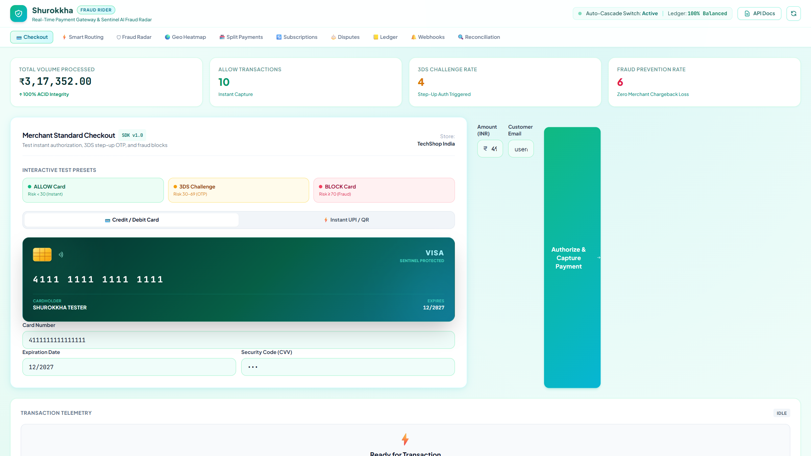
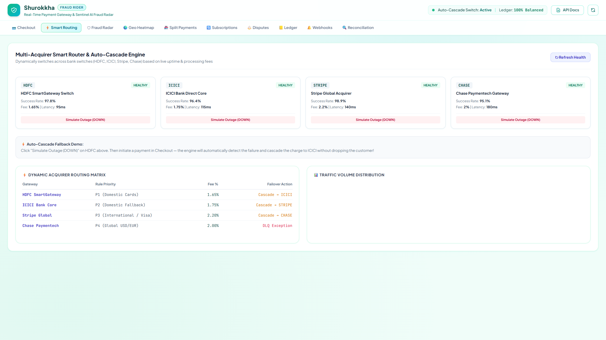
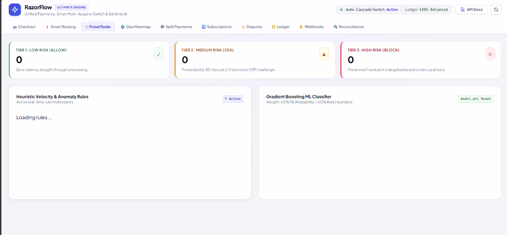
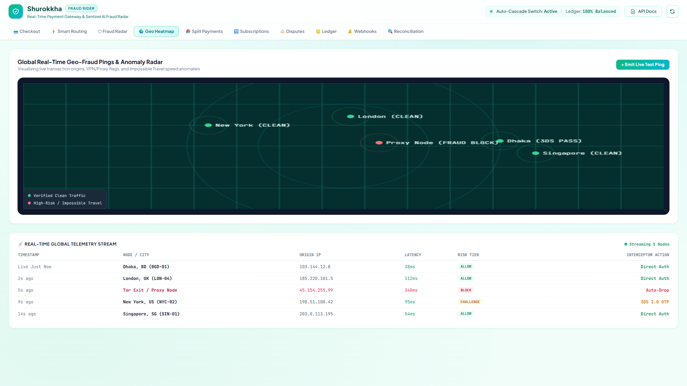
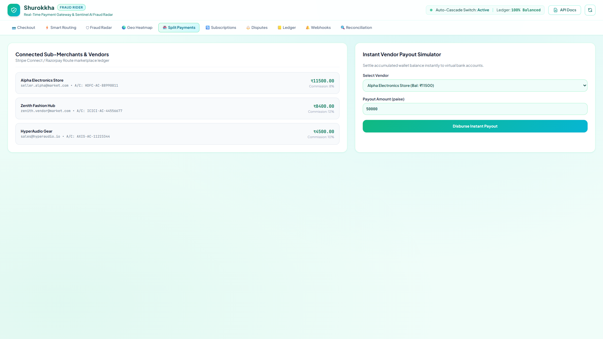
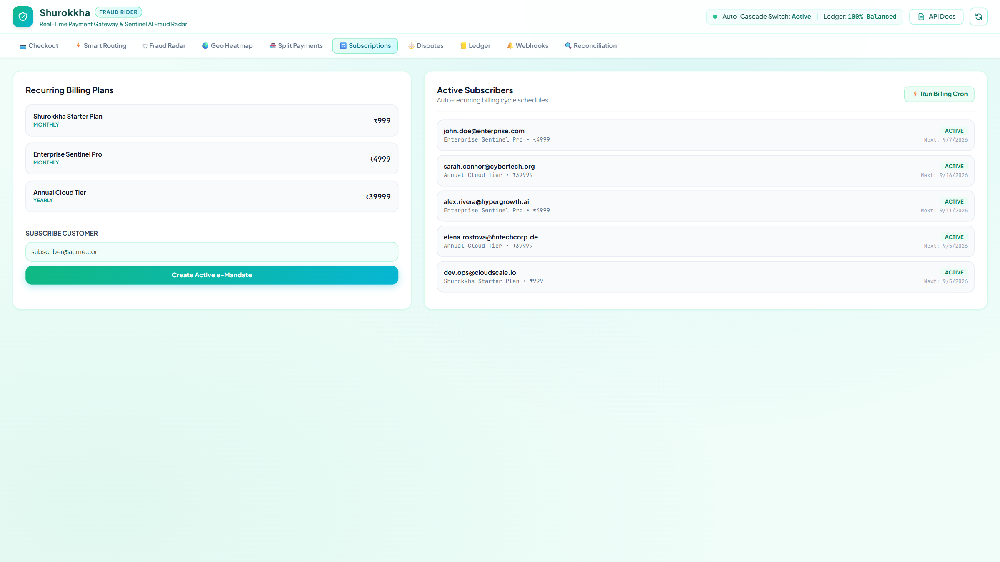
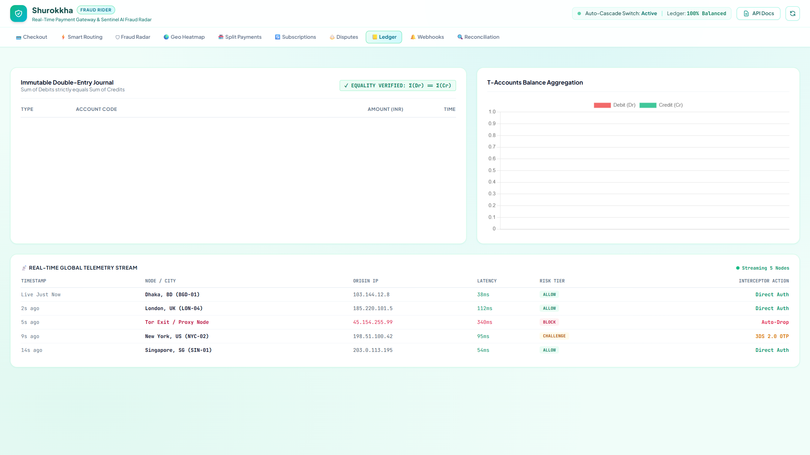
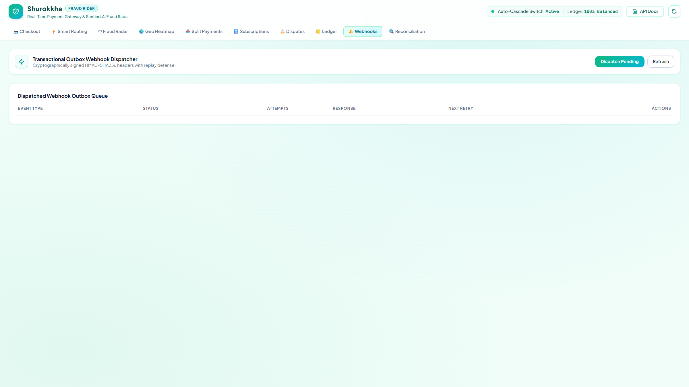
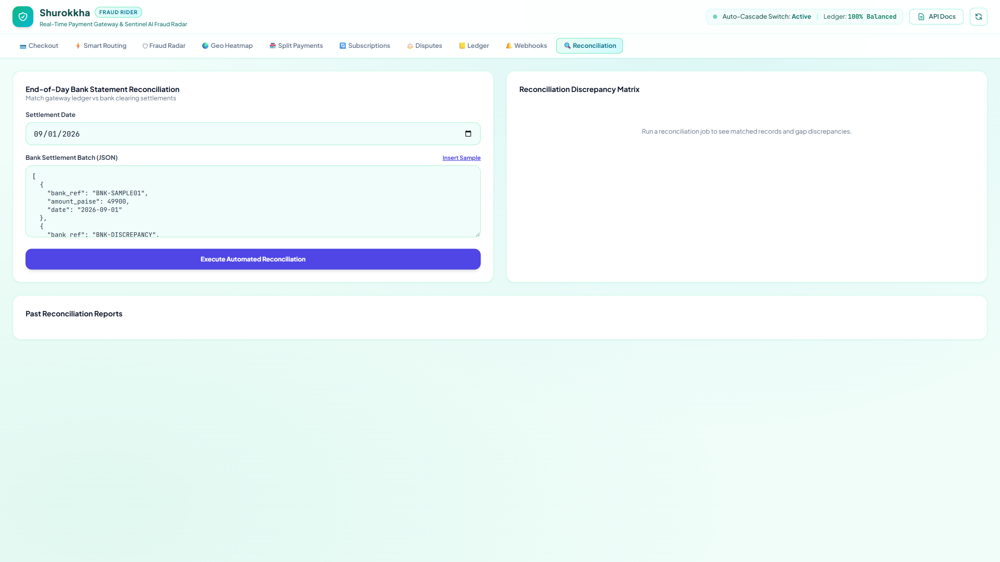
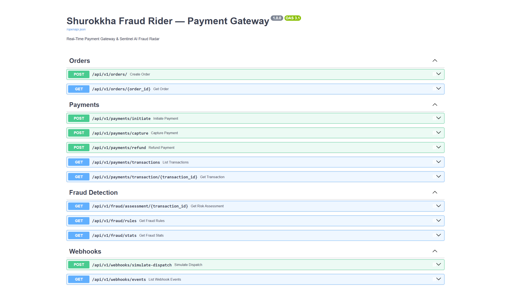

<div align="center">


<br/>

[](https://fastapi.tiangolo.com)
[](https://python.org)
[](https://scikit-learn.org)
[](https://sqlalchemy.org)
[](#)
[](LICENSE)

<br/>

> **An end-to-end, production-grade FinTech engine** inspired by Stripe, Razorpay & Juspay Hyperswitch.  
> Built from scratch — every line of code written by hand.

<br/>

**Developed by [Rakib](https://github.com/rakibdipu)**

<br/>

</div>

---

## ✨ What is RazorFlow?

**RazorFlow Enterprise** is a complete, self-contained FinTech payment gateway system with 10 production-grade modules — all running locally or deployable to any cloud. It covers everything from AES-256 card tokenization to ML-based fraud detection, double-entry bookkeeping, marketplace split payments, recurring subscriptions, and HMAC-signed webhooks.

This was built as a deep-dive learning project to understand how real payment systems like **Stripe**, **Razorpay**, and **Juspay** work under the hood — transaction security, bank routing, fraud prevention, and financial integrity.

---

## 📸 UI Showcase

### 💳 Checkout Simulator — Card, UPI QR & 3DS OTP
> AES-256-GCM tokenized card vault with real-time Sentinel risk scoring and 3D-Secure 2.0 step-up challenge flow.



<br/>

### ⚡ Smart Multi-Acquirer Router & Auto-Cascade Engine
> Dynamically routes transactions across HDFC, ICICI, Stripe, and Chase based on live success rates and fees. Auto-cascades on outage — zero customer drop.



<br/>

### 🛡 Sentinel AI Fraud Radar — 7 Rules + ML Classifier
> Real-time heuristic velocity rules blended with a trained `GradientBoostingClassifier`. Scores 0–100: ALLOW, CHALLENGE, BLOCK.



<br/>

### 🌍 Global Geo-Fraud Heatmap & Telemetry Stream
> Canvas-rendered world ping radar showing real-time transaction nodes, Tor/Proxy anomalies, and impossible travel speed detection.



<br/>

### 🏪 Marketplace Split Payments & Instant Vendor Payouts
> Stripe Connect-style multi-vendor split engine with per-vendor commission deduction and instant settlement to virtual bank accounts.



<br/>

### 🔄 Recurring Subscriptions & UPI AutoPay Engine
> Monthly and annual e-Mandate registration, automated recurring billing cycles, and dunning retry logic for failed renewals.



<br/>

### 📒 Strict Double-Entry Bookkeeping Ledger
> Every paisa tracked across 4 immutable T-accounts. Mathematically verified: **Σ Debits = Σ Credits** on every single transaction.



<br/>

### 🔔 Transactional Outbox Webhook Dispatcher
> HMAC-SHA256 signed payloads with timestamp anti-replay defense, exponential backoff retries, and Dead Letter Queue (DLQ) with manual replay.



<br/>

### 🔍 Automated End-of-Day Bank Reconciliation
> Ingests bank clearing settlement CSVs and classifies records: `MATCHED`, `AMOUNT_MISMATCH`, `MISSING_IN_BANK`, `EXTRA_IN_BANK`.



<br/>

### 📖 Interactive OpenAPI / Swagger Documentation
> 25+ production REST endpoints across 10 fully documented API controllers.



---

## 🏛 Architecture Overview

```
  ┌──────────────────────────────────────────────────────────────────┐
  │                    Merchant / Checkout Client                    │
  └───────────────────────────────┬──────────────────────────────────┘
                                  │
                    ┌─────────────▼─────────────┐
                    │   Idempotency Guard        │
                    │   + AES-256-GCM Card Vault │
                    └─────────────┬─────────────┘
                                  │
                    ┌─────────────▼─────────────┐
                    │   Sentinel AI Fraud Radar  │
                    │  ┌────────────┬──────────┐ │
                    │  │  7 Rules   │  ML GBM  │ │
                    │  └────────────┴──────────┘ │
                    │   60% Rules + 40% ML       │
                    └──────┬───────┬────────┬────┘
                           │       │        │
                      ALLOW   CHALLENGE   BLOCK
                           │       │        │
                           │  3DS OTP    Rejected
                           │       │
                    ┌──────▼───────▼──────────────┐
                    │  Smart Multi-Acquirer Router  │
                    │  HDFC → ICICI → Stripe → Chase│
                    │  (Auto-Cascade on Outage)     │
                    └───────────────┬───────────────┘
                                    │
              ┌─────────────────────┴──────────────────┐
              │                                        │
   ┌──────────▼────────────┐           ┌───────────────▼──────────────┐
   │  Double-Entry Ledger  │           │  Webhook Outbox + DLQ Worker  │
   │  (ACID: ΣDr = ΣCr)    │           │  (HMAC-SHA256 Signed Events)  │
   └───────────────────────┘           └──────────────────────────────┘
```

---

## 🛠 Tech Stack

| Layer | Technology | Why |
|---|---|---|
| **API Framework** | FastAPI + Uvicorn | Async, type-safe, blazing fast |
| **Database** | SQLAlchemy 2.0 + SQLite (WAL mode) | ACID transactions, zero external dependency |
| **ML Engine** | Scikit-Learn `GradientBoostingClassifier` | Trained on 2,000 synthetic fraud vectors |
| **Cryptography** | `cryptography` (AESGCM) + `hmac` | PCI-DSS Grade AES-256-GCM + HMAC-SHA256 |
| **Frontend** | Vanilla JS + Tailwind CSS + Chart.js + QRCode.js | Zero build tools, clean SaaS light mode UI |

---

## ⚡ Quick Start

```bash
# 1. Clone
git clone https://github.com/rakibdipu/razorflow-gateway.git
cd razorflow-gateway

# 2. Create virtual environment & install
python -m venv venv
source venv/bin/activate        # Linux/macOS
.\venv\Scripts\Activate.ps1     # Windows PowerShell

pip install -r backend/requirements.txt

# 3. Start the server
cd backend
python -m uvicorn app.main:app --host 0.0.0.0 --port 8000 --reload
```

Then open:
- 🖥 **Dashboard UI** → http://127.0.0.1:8000/
- 📖 **Swagger API** → http://127.0.0.1:8000/docs

---

## 🧪 Test Cards

| Preset | Card Number | CVV | Expected Result |
|---|---|---|---|
| ✅ **ALLOW** | `4111 1111 1111 1111` | `123` | Risk score < 30, instant capture |
| ⚠️ **3DS Challenge** | `4000 0000 0000 0002` | `111` | Risk 30–69, OTP step-up required |
| 🚫 **BLOCK (Fraud)** | `4000 0000 0000 0069` | `000` | Risk ≥ 70, auto-rejected |

---

## 📁 Project Structure

```
razorflow-gateway/
├── docs/assets/              # UI screenshots used in this README
├── backend/
│   ├── app/
│   │   ├── api/v1/           # 10 REST API controllers
│   │   ├── core/             # AES-256 vault, HMAC signer, config
│   │   ├── ml/               # Fraud model training & inference
│   │   ├── models/           # 14 SQLAlchemy tables + Pydantic DTOs
│   │   ├── services/         # Business logic engines
│   │   └── main.py           # App lifespan & router setup
│   └── requirements.txt
├── frontend/
│   └── index.html            # Complete SaaS dashboard SPA
└── README.md
```

---

## 🔒 Security Highlights

- **Card PAN never stored in plaintext** — AES-256-GCM encrypted with per-entry 12-byte nonce
- **Webhook replay protection** — HMAC timestamp verified within 300-second window
- **Double-entry integrity** — every transaction algebraically verified: `Σ Dr = Σ Cr`
- **Fraud escrow** — disputed funds auto-locked in `FRAUD_HOLD` T-account pending resolution

---

<div align="center">

<br/>

**Built with 💜 by [Rakib](https://github.com/rakibdipu)**

*If you found this useful, consider giving it a ⭐ on GitHub!*


</div>
